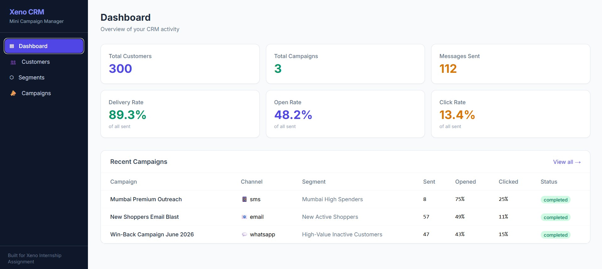
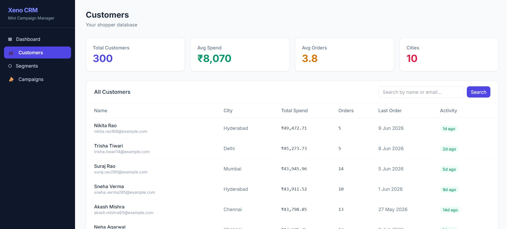
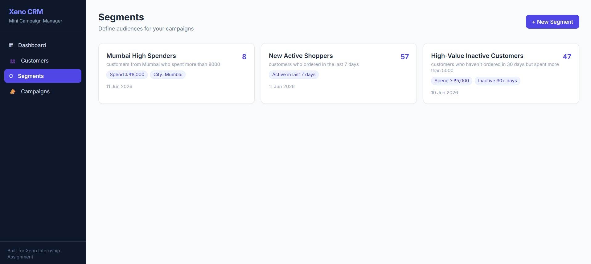
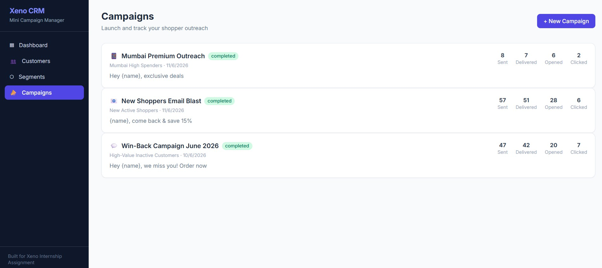
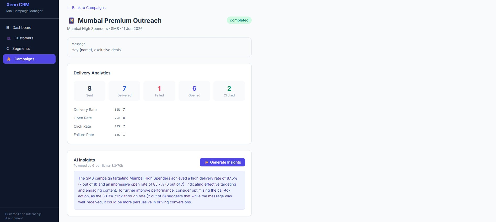

# Xeno Mini CRM

An AI-native campaign manager that helps retail brands decide **who to talk to**, **what to say**, and **reach them** over messaging channels — then tracks how those messages performed.

AI-native CRM for shopper engagement, audience segmentation, campaign orchestration, and delivery analytics.

---

## Live Demo

| Service | URL |
|---------|-----|
| Frontend | https://xeno-ai-mini-crm.vercel.app |
| Backend API | https://xeno-ai-mini-crm-production.up.railway.app |
| API Docs (Swagger) | https://xeno-ai-mini-crm-production.up.railway.app/docs |
| Channel Service | https://artistic-consideration-production-d8f9.up.railway.app |
| GitHub Repo | https://github.com/Hardikdhawan2904/xeno-ai-mini-crm |

> Public demo environment — no authentication required.

---

## Screenshots

### Dashboard


### Customers


### AI Segment Builder


### Campaigns


### Campaign Analytics


---

## Architecture

```
┌─────────────────────────────────────┐
│         Frontend  (Next.js)          │
│         Vercel / localhost:3000      │
└────────────────┬────────────────────┘
                 │ REST
┌────────────────▼────────────────────┐
│        CRM Backend  (FastAPI)        │
│        Railway / localhost:8000      │
│                                      │
│  /api/customers   /api/segments      │
│  /api/campaigns   /api/ai            │
│  /api/receipts  ◄── webhook          │
└──────────┬──────────────────────────┘
           │ POST /send (per recipient)
┌──────────▼──────────────────────────┐
│     Channel Service  (FastAPI)       │
│     Railway / localhost:8001         │
│                                      │
│  Simulates delivery lifecycle:       │
│  sent → delivered → opened → clicked │
│  Callbacks CRM async via /receipts   │
└─────────────────────────────────────┘
           │
┌──────────▼──────────────────────────┐
│   PostgreSQL (Production, Railway)   │
│     SQLite (Local Development)       │
└─────────────────────────────────────┘
```

### Why two services?

Real channel providers (Twilio, Gupshup, MSG91) are external — your CRM calls them, and they call you back asynchronously with delivery events. The channel service stub mirrors that contract exactly, making the architecture production-realistic rather than a simulation hidden inside the CRM.

---

## AI Touch Points

| Where | What AI does |
|-------|-------------|
| Segment Builder | Converts plain English → JSON filter dict via Groq (llama-3.3-70b) |
| Campaign Creation | Generates 3 personalized message variants for the marketer to choose from |
| Campaign Detail | Summarizes delivery + engagement metrics into a 2-sentence performance narrative |

AI assists marketers at key decision points: audience creation, campaign content generation, and performance analysis.

---

## Features

- **Data ingestion** — bulk import customers and orders via API
- **AI segment builder** — describe your audience in plain English; AI builds the filters
- **Campaign creation** — 3-step flow: audience → AI message variants → launch
- **Callback-driven analytics** — channel service simulates delivery lifecycle asynchronously; CRM ingests receipts and updates stats in real time
- **Live dashboard** — frontend polls every 3 seconds while callbacks are pending
- **AI insights** — one-click Groq summary of campaign performance

---

## Stack

| Layer | Tech |
|-------|------|
| Frontend | Next.js 14, TypeScript, Tailwind CSS |
| CRM Backend | Python, FastAPI, SQLAlchemy |
| Channel Service | Python, FastAPI, httpx |
| Database | PostgreSQL (local + production via Railway) |
| AI | Groq API — llama-3.3-70b-versatile |
| Hosting | Vercel (frontend) + Railway (backend + channel service) |

---

## Local Setup

**Prerequisites:** Python 3.11+, Node.js 18+

```bash
# 1. Backend
cd backend
pip install -r requirements.txt
cp .env.example .env          # add your GROQ_API_KEY
python seed.py                 # seeds 300 customers + orders
python -m uvicorn app.main:app --port 8000 --reload

# 2. Channel service
cd channel-service
pip install -r requirements.txt
cp .env.example .env
python -m uvicorn app.main:app --port 8001 --reload

# 3. Frontend
cd frontend
npm install
cp .env.local.example .env.local
npm run dev
```

Open `http://localhost:3000`.

---

## Project Structure

```
xeno/
├── backend/
│   ├── app/
│   │   ├── main.py            # FastAPI app, CORS, router registration
│   │   ├── models.py          # SQLAlchemy models
│   │   ├── database.py        # Engine + session factory
│   │   ├── routers/           # customers, segments, campaigns, receipts, ai
│   │   └── services/          # ai_service, segment_service, campaign_service
│   └── seed.py                # 300 realistic Indian retail customers
├── channel-service/
│   └── app/main.py            # Stub delivery service with async callbacks
└── frontend/
    └── src/
        ├── app/               # Next.js pages (dashboard, customers, segments, campaigns)
        ├── components/        # Sidebar, StatsCard
        └── lib/               # API client, TypeScript types
```

---

## Scaling Considerations

This build optimises for correctness and clarity at demo scale. Here is how each layer would evolve under production load:

| Concern | Current | At Scale |
|---------|---------|----------|
| Campaign dispatch | `asyncio.gather` — concurrent HTTP sends in-process | Celery + Redis: durable task queue, retries, dead-letter |
| Channel callbacks | Direct HTTP with exponential backoff | Kafka / SQS: ordered, replay-safe event stream |
| Real-time stats | Frontend polls every 3 s | WebSockets or Server-Sent Events |
| Database | Single PostgreSQL instance | Read replicas for analytics queries; campaigns table partitioned by `created_at` |
| AI calls | Synchronous Groq call per request | Async with caching; pre-generate segments nightly for large audiences |
| Multi-tenancy | Single brand, no auth | JWT + row-level security in PostgreSQL; brand_id on every table |

The two-service, callback-driven architecture was chosen deliberately — it is the same shape as production CRM infrastructure and makes the scaling path above straightforward rather than a rewrite.

---

## Tradeoffs Made

- **SQLite locally (optional)** — zero-config fallback if no DATABASE_URL is set; env var switches to PostgreSQL for both local and production
- **No auth** — out of scope per assignment; would add JWT + Supabase Auth in production
- **Polling over WebSockets** — simpler to reason about and debug; acceptable at this scale
- **Groq llama-3.3-70b** — fast and free tier is generous; swappable via a single env var
